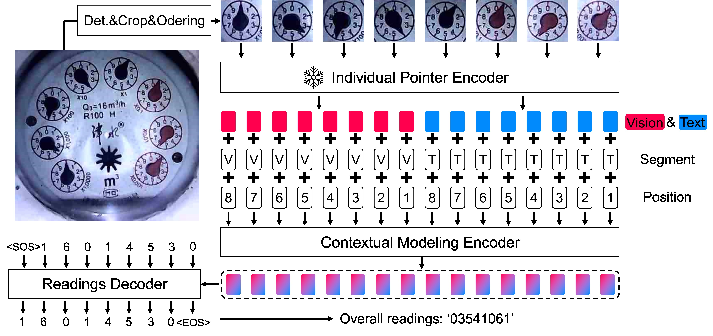
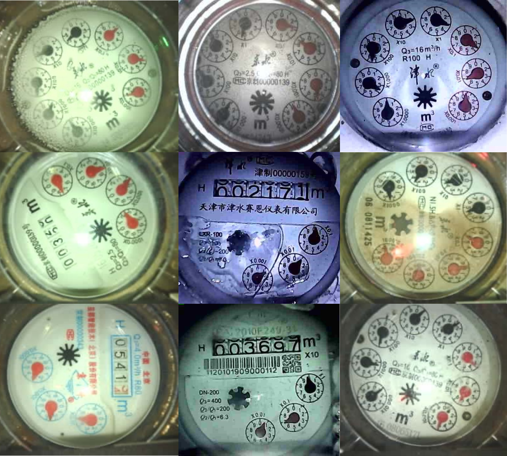
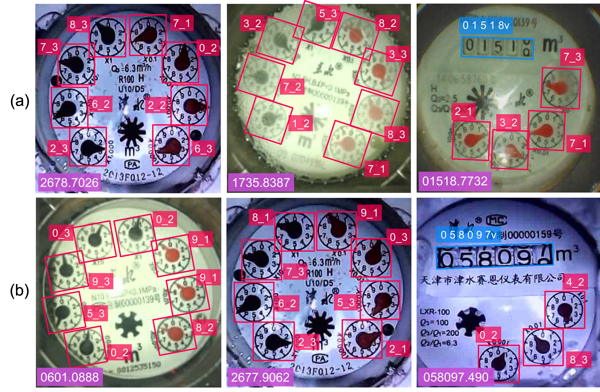

# WMeter-Reader

This repository contains the codes and dataset for our paper "[Towards Accurate Readings of Water Meters by Eliminating Uncertainty and Parallax: New Dataset and Effective Solution]()". (Coming later upon paper publication)


## Methodology

<p align="center">
  
</p>

## WMeter5K dataset
WMeter5K totally contains 5,000 water meter images, which are all captured by the add-on camera attached to real-world water meters. Some example images from WMeter5K are presented as below.
<p align="center">
  
</p>

Fine-grained annotations are provided for each image, including bounding box and readings for each digital wheel and pointer, and the overall readings of the entire meter. Some examples of the provided annotations for WMeter5K are illustrated as below.
<p align="center">
  
</p>


## Citation
If you are using our code and data, please consider citing our paper.
```
@article{zhang2023wmeter,
title={Towards Accurate Readings of Water Meters by Eliminating Uncertainty and Parallax: New Dataset and Effective Solution},
author={Zhang, Jiaxin and Liu, chongyu and Peng, Dezhi and Chen, Bangdong and Gao, Xue and Jin, Lianwen},
year={2023}}
```
