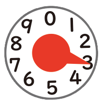

<div align=center>

#  Towards Accurate Readings of Water Meters by Eliminating Transition Error: New Dataset and Effective Solution

</div>


This is the official implementation of our paper [Towards Accurate Readings of Water Meters by Eliminating Transition Error: New Dataset and Effective Solution](https://onedrive.live.com/?id=B86CDD552799794D%21153685&resid=B86CDD552799794D%21153685&ithint=folder&redeem=aHR0cHM6Ly8xZHJ2Lm1zL2YvcyFBazE1bVNkVjNXeTRpYkJWa3JEZXJiU1hMYUVIN1E%5FZT1SVXpFUng&migratedtospo=true&cid=b86cdd552799794d&v=validatepermission).

## News 
🔥 A comprehensive list of [Awesome Image-based Meter Recognition Reading](https://github.com/ZZZHANG-jx/Awesome-Image-based-Meter-Recognition-Reading) methods and datasets is available.


## Methodology
<p align="center">
  
</p>


## WMeter5K dataset 
WMeter5K totally contains 5,000 water meter images, which are all captured by the add-on camera attached to real-world water meters. Fine-grained annotations are provided for each image, including bounding box and readings for each digital wheel and pointer, and the overall readings of the entire meter. 
<p align="center">
   
</p>

1. Down load WMeter5K from [here](https://1drv.ms/f/s!Ak15mSdV3Wy4ibBVkrDerbSXLaEH7Q?e=RUzERx) and put it to `./dataset/WMeter5K`
2. Use `./dataset/visualize.py` for visualization.

## Inference
1. Put the model weights [im.pkl](https://1drv.ms/f/s!Ak15mSdV3Wy4ibBVkrDerbSXLaEH7Q?e=RUzERx) and [tr.pkl](https://1drv.ms/f/s!Ak15mSdV3Wy4ibBVkrDerbSXLaEH7Q?e=RUzERx) to `./checkpoint/`
2. Prepare the water meter image and the corresponding detection annotations. Use `./demo/cropping.py` to obtain cropped pointer images.
3. Run the following script for inference
```bash 
python val_and_test.py --mode test --img_folder ./demo/pointers/
```

## Evaluation 
1. Down load WMeter5K from [here](https://1drv.ms/f/s!Ak15mSdV3Wy4ibBVkrDerbSXLaEH7Q?e=RUzERx) and put it to `./dataset/WMeter5K`
2. Run the following script for evaluation on WMeter5K's test set
```bash 
python val_and_test.py --mode val
```

## Training 
1. Down load WMeter5K from [here](https://1drv.ms/f/s!Ak15mSdV3Wy4ibBVkrDerbSXLaEH7Q?e=RUzERx) and put it to `./dataset/WMeter5K`
2. Prepare the LMDB version for WMeter5K by runing 
```bash 
python createlmdb.py
```
3. Put the model weights [im.pkl](https://1drv.ms/f/s!Ak15mSdV3Wy4ibBVkrDerbSXLaEH7Q?e=RUzERx) to `./checkpoint/`
4. Run the following script for training
```bash
python train.py
```

### Citation:
```
@inproceedings{zhangwater2024, 
Author = {Jiaxin Zhang, Daizhen Jia, Chongyu Liu, Dezhi Peng, Bangdong Chen, Xue Gao and Lianwen Jin}, 
Booktitle = {IEEE Transactions on Instrument and Measurement}, 
Title = {Towards Accurate Readings of Water Meters by Eliminating Transition Error: New Dataset and Effective Solution, 
Year = {2024}}   
```
## ⭐ Star Rising
[](https://star-history.com/#ZZZHANG-jx/WMeter-Reader&Timeline)
